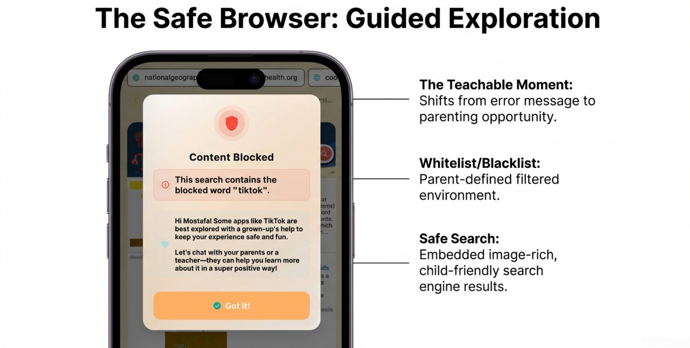
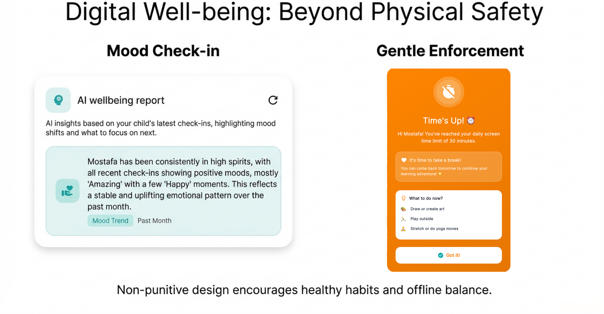
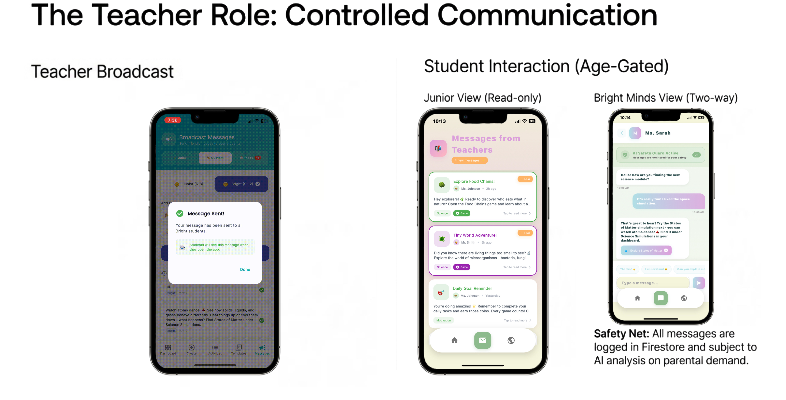
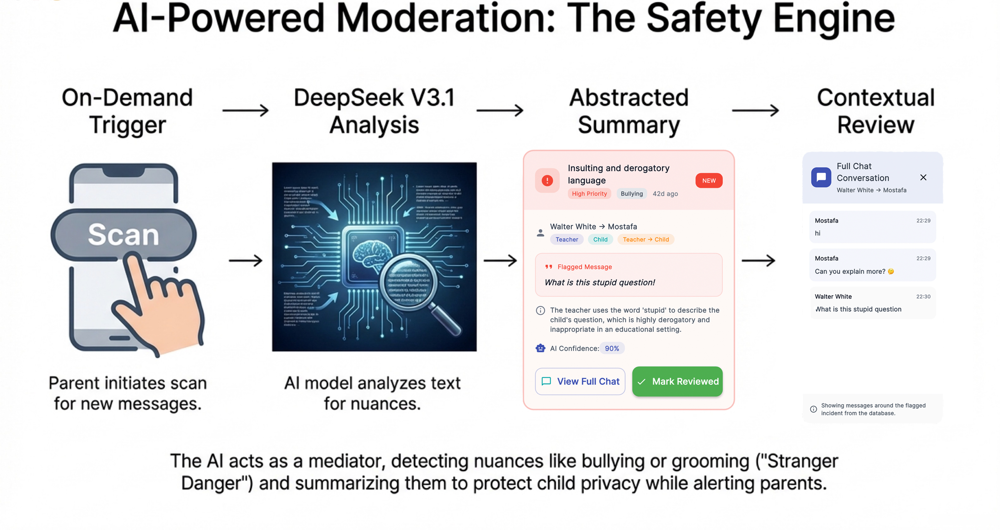
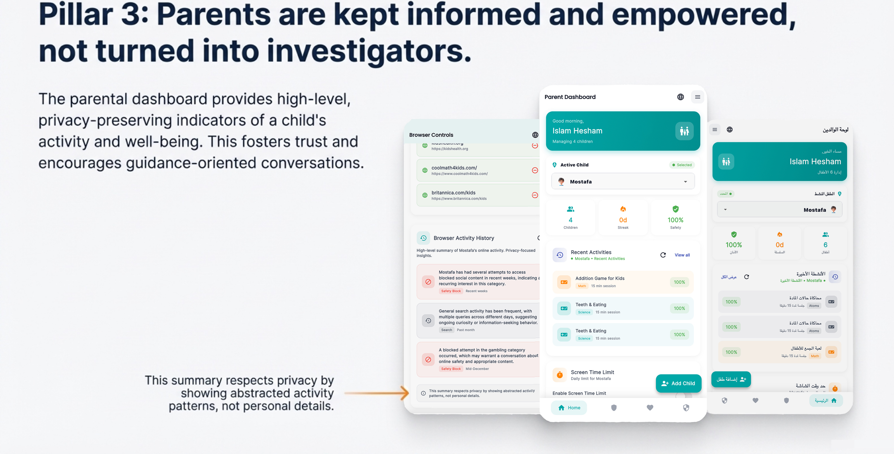
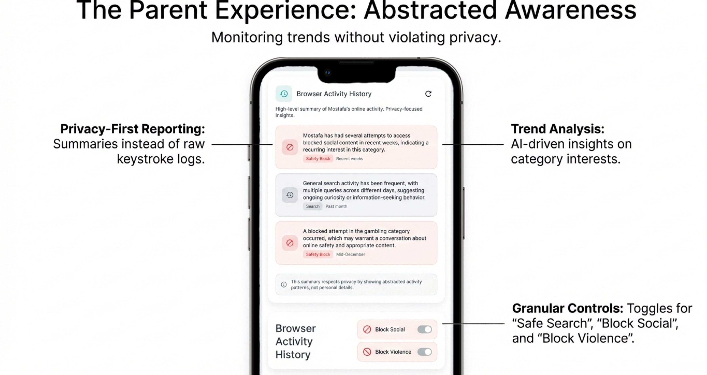
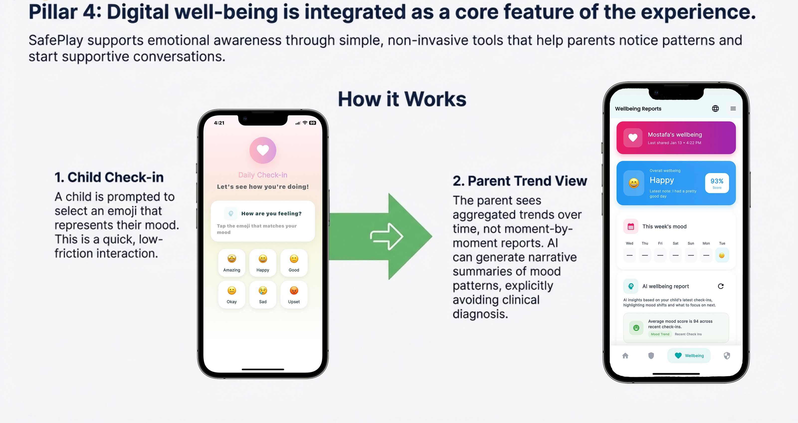

# SafePlay Mobile

## Project Identity

- Full name: SafePlay - A Child-Centric Safety-First Gamified Platform
- Tagline: An integrated educational ecosystem that replaces surveillance with mediation, combining gamified learning, AI-assisted safety, and digital well-being for children aged 6-12.
- Status: Active development
- App version: `1.0.0+1` (from `pubspec.yaml`)
- Last README update: 2026-02-17

## App Showcase

- Local demo media: `screenshots/`
- Shared demo folder: <https://drive.google.com/drive/folders/1KqcR9Bb67L80J3E9ZA4FobT1jjQynCo_>

<table>
  <tr>
    <td align="center" width="50%">
      <br/>
      <sub>Child dashboard</sub>
    </td>
    <td align="center" width="50%">
      <br/>
      <sub>Showcase of coins collected after a game</sub>
    </td>
  </tr>
  <tr>
    <td align="center" colspan="2">
      <br/>
      <sub>Games section</sub>
    </td>
  </tr>
  <tr>
    <td align="center" colspan="2">
      <br/>
      <sub>Safe browser section</sub>
    </td>
  </tr>
  <tr>
    <td align="center" colspan="2">
      <br/>
      <sub>Guided exploration</sub>
    </td>
  </tr>
  <tr>
    <td align="center" colspan="2">
      <br/>
      <sub>Gentle enforcement</sub>
    </td>
  </tr>
  <tr>
    <td align="center" colspan="2">
      <br/>
      <sub>Login mechanism</sub>
    </td>
  </tr>
  <tr>
    <td align="center" colspan="2">
      <br/>
      <sub>Messaging service</sub>
    </td>
  </tr>
  <tr>
    <td align="center" colspan="2">
      <br/>
      <sub>AI powered moderation</sub>
    </td>
  </tr>
  <tr>
    <td align="center" colspan="2">
      <br/>
      <sub>Parents dashboard</sub>
    </td>
  </tr>
  <tr>
    <td align="center" colspan="2">
      <br/>
      <sub>Abstracted awareness</sub>
    </td>
  </tr>
  <tr>
    <td align="center" colspan="2">
      <br/>
      <sub>Digital wellbeing</sub>
    </td>
  </tr>
</table>

## Table of Contents

- [Overview](#overview)
- [Core Philosophy](#core-philosophy)
- [Target Audience and Roles](#target-audience-and-roles)
- [Core Features](#core-features)
- [Thesis Context and Validation](#thesis-context-and-validation)
- [Technology Stack](#technology-stack)
- [Project Structure](#project-structure)
- [Prerequisites](#prerequisites)
- [Local Setup](#local-setup)
- [Environment Variables](#environment-variables)
- [Run the App](#run-the-app)
- [Testing](#testing)
- [Firebase Operations](#firebase-operations)
- [Deployment](#deployment)
- [Troubleshooting](#troubleshooting)

## Overview

SafePlay Mobile is a multi-role Flutter platform that combines learning, child safety, and parent/teacher oversight in one app.

It supports:

- Children with age-adaptive experiences
- Parents with insight-focused controls
- Teachers with guided classroom communication and activity publishing

The project emphasizes developmental appropriateness, trust-preserving safety, and practical family mediation.

## Core Philosophy

The main design goal is moving from surveillance and restriction to mediation and guidance.

### Problem Statement

Many parental-control tools focus on hard blocking and passive monitoring. This can:

- weaken trust between children and caregivers
- treat safety as punishment
- ignore developmental differences between younger and older children

### The Four Pillars

1. Child-Centric by Design

- Interface complexity and authentication adapt by age group.
- Junior users get simpler flows and visual interactions.
- Bright users get richer flows and stronger login patterns.

Implementation references:

- `lib/screens/junior/`
- `lib/screens/bright/`
- `lib/screens/auth/unified_child_login_screen.dart`

2. Mediation, Not Just Moderation

- Blocking is paired with supportive, explanatory feedback.
- The app presents child-friendly guidance when unsafe queries are blocked.

Implementation references:

- `lib/screens/safety/safe_search_screen.dart`
- `lib/services/mediation_guidance_service.dart`

3. Informed Parents, Not Investigators

- Parent workflows are centered around summarized signals, review queues, and trend insights.
- Safety analysis is parent-triggered, not continuous hidden surveillance.

Implementation references:

- `lib/providers/messaging_safety_provider.dart`
- `lib/services/chat_safety_monitoring_service.dart`
- `lib/screens/parent/parent_dashboard_screen.dart`

4. Well-being as a Feature

- Safety includes emotional and behavioral context, not only content filtering.
- Mood check-ins and trend summaries help parents identify patterns over time.

Implementation references:

- `lib/providers/wellbeing_provider.dart`
- `lib/services/wellbeing_service.dart`
- `lib/services/wellbeing_insights_service.dart`

## Target Audience and Roles

1. Junior Explorers (ages 6-8)

- Simplified UI and visual-first interactions
- Picture-sequence authentication
- Access to age-appropriate activities and guided browsing

2. Bright Minds (ages 9-12)

- More advanced flows and content
- Picture plus PIN authentication
- Access to richer learning content and teacher communication features

3. Parents

- Manage child profiles and safety settings
- Review AI safety scans and browsing controls
- Track progress, engagement, and well-being trends

4. Teachers

- Manage assignments and classroom communication
- Publish educational content and monitor student progress

## Core Features

### Age-Adaptive Authentication

- Junior: 4-item picture sequence login
- Bright: 3-picture plus 4-digit PIN login
- Parent/Teacher: email/password with optional biometric support

Implementation references:

- `lib/services/auth_service.dart`
- `lib/screens/auth/bright_picture_pin_login.dart`
- `lib/screens/auth/bright_picture_pin_setup.dart`
- `lib/screens/auth/unified_child_login_screen.dart`

### Gamified Learning Hub

- Subject areas include science, math, and language content
- Interactive mini games under `lib/screens/junior/games/`
- Simulation/web experiences and activity progression logic

Implementation references:

- `lib/services/activity_service.dart`
- `lib/services/web_game_service.dart`
- `lib/screens/junior/games/`
- `lib/screens/activities/activity_player_screen.dart`

### Safety Engine (AI plus Mediation)

- DeepSeek V3.1 via OpenRouter for safety classification
- Parent-triggered scans for messaging risk categories
- Alert-oriented outputs with review workflow in parent dashboard

Implementation references:

- `lib/services/chat_safety_monitoring_service.dart`
- `lib/providers/messaging_safety_provider.dart`
- `lib/models/chat_safety_alert.dart`

### Safe Explorer Browser

- Built-in child browser flow with safe-search-oriented defaults
- Domain/category filters, blocked keywords, and allowed-site rules
- Friendly mediation dialog on blocked actions

Implementation references:

- `lib/screens/safety/safe_search_screen.dart`
- `lib/providers/browser_control_provider.dart`
- `lib/services/browser_control_service.dart`
- `lib/models/browser_control_settings.dart`

### Digital Well-being

- Mood check-ins stored per child
- Parent-facing trend summaries and AI-generated well-being insights
- Screen-time control with gentle prompt UI

Implementation references:

- `lib/services/wellbeing_service.dart`
- `lib/services/wellbeing_insights_service.dart`
- `lib/widgets/screen_time_limit_popup.dart`

## Thesis Context and Validation

This project originated as a bachelor thesis graduation project.

Reported validation outcomes from the thesis context include:

- Study cohort: 26 children (ages 6-12) with parent involvement
- Learning outcome example: science conceptual scores reportedly improved from around 45% pre-test to above 92% post-test
- Parent usability perception: high acceptance and ease-of-learning feedback

Important reliability note:

- These values should be treated as thesis-reported outcomes, not universal guarantees.
- If you publish this repository externally, include a direct citation or link to the thesis document and evaluation methodology.

## Technology Stack

- Framework: Flutter
- Language: Dart (SDK constraint `>=3.0.0 <4.0.0`)
- State management: Provider
- Navigation: GoRouter
- Backend: Firebase (Auth, Firestore, Analytics, Messaging, Storage)
- Local storage: SharedPreferences and Flutter Secure Storage
- AI integration: OpenRouter API with DeepSeek V3.1
- Media/web: `flutter_tts`, `audioplayers`, `flutter_pdfview`, `flutter_inappwebview`

## Project Structure

```text
safeplay_mobile/
|- lib/
|  |- constants/
|  |- data/
|  |- design_system/
|  |- localization/
|  |- models/
|  |- navigation/
|  |- providers/
|  |- screens/
|  |- services/
|  |- utils/
|  |- widgets/
|  |- FIRESTORE_INDEXES.md
|  |- firebase_options.dart
|  `- main.dart
|- assets/
|- android/
|- ios/
|- web/
|- windows/
|- macos/
|- linux/
|- test/
|  |- integration/
|  |- services/
|  `- widgets/
|- scripts/
|- .github/workflows/
|- firebase.json
|- firestore.rules
|- firestore.indexes.json
|- pubspec.yaml
`- README.md
```

## Prerequisites

- Flutter SDK installed and available in PATH
- Dart SDK (bundled with Flutter)
- Firebase project for this app
- FlutterFire CLI for Firebase config generation
- Platform tools as needed: Android Studio for Android and Xcode for iOS/macOS

## Local Setup

1. Clone and enter the project.

```bash
git clone https://github.com/IslamHesham-Dev/safeplay_mobile.git
cd safeplay_mobile
```

2. Install dependencies.

```bash
flutter pub get
```

3. Configure Firebase for your local environment.

```bash
dart pub global activate flutterfire_cli
flutterfire configure
```

4. Optional but recommended: deploy Firestore rules and indexes.

```bash
firebase deploy --only firestore:rules
firebase deploy --only firestore:indexes
```

## Environment Variables

Runtime OpenRouter settings are read from `lib/constants/env_config.dart`:

- `OPENROUTER_API_KEY`
- `OPENROUTER_APP_URL` (default: `https://safeplay.app`)
- `OPENROUTER_APP_NAME` (default: `SafePlay Mobile`)

Pass values directly:

```bash
flutter run \
  --dart-define=OPENROUTER_API_KEY=sk-or-xxxxxxxx \
  --dart-define=OPENROUTER_APP_URL=https://safeplay.app \
  --dart-define=OPENROUTER_APP_NAME="SafePlay Mobile"
```

Or use file-based defines:

```powershell
Copy-Item .env.example .env
flutter run --dart-define-from-file=.env
```

```bash
cp .env.example .env
flutter run --dart-define-from-file=.env
```

Notes:

- `.env.example` includes additional CI/build variables used by workflows.
- Mobile runtime currently consumes the `OPENROUTER_*` values above.
- Do not commit real secrets.

## Run the App

```bash
flutter devices
flutter run
```

Examples:

```bash
flutter run -d android
flutter run -d ios
flutter run -d chrome
```

## Testing

Run all tests:

```bash
flutter test
```

Run by area:

```bash
flutter test test/services
flutter test test/widgets
flutter test test/integration
```

Generate coverage:

```bash
flutter test --coverage
```

## Firebase Operations

Deploy security rules:

```bash
firebase deploy --only firestore:rules
```

Deploy indexes:

```bash
firebase deploy --only firestore:indexes
```

## Deployment

iOS:

```bash
flutter build ipa
```

Android:

```bash
flutter build appbundle
# or
flutter build apk --release
```

Web:

```bash
flutter build web --release
firebase deploy --only hosting
```

Helpful scripts:

- Root: `deploy_to_firebase.ps1`, `start_web_server.ps1`, `start_website.ps1`, `start_website_network.ps1`
- iOS optimization: `scripts/optimize_ios_build.ps1`, `scripts/optimize_ios_build.sh`, `scripts/clean_ios_build.sh`

## Troubleshooting

Firebase initialization issues:

```bash
flutterfire configure
flutter pub get
flutter clean
flutter run
```

iOS CocoaPods issues:

```bash
cd ios
pod install
cd ..
flutter run
```

General dependency/build issues:

```bash
flutter clean
flutter pub get
flutter pub upgrade
flutter run
```

OpenRouter safety API issues:

- Confirm `OPENROUTER_API_KEY` is set
- Confirm `--dart-define` or `--dart-define-from-file` is passed at run/build time
- Confirm API quota and model access on your OpenRouter account
